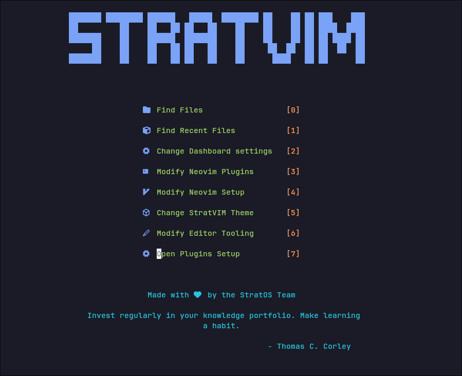

# Introduction:
StratVIM is a custom neovim configuration made for StratOS. 

# What is it made using?
It is made using [lazy.nvim](https://github.com/folke/lazy.nvim) as its plugin manager. It contains some extra plugins like telescope-themes, cheatsheet.nvim etc for the convenience of the user.

# What features does StratVIM have ?

- Theme switching using [telescope-themes](https://github.com/andrew-george/telescope-themes)

- Lazy loaded using [lazy.nvim](https://github.com/folke/lazy.nvim)

- Git management via [lazygit.nvim](https://github.com/kdheepak/lazygit.nvim)

- Dashboard made using [dashboard.nvim](https://github.com/nvimdev/dashboard-nvim)

- Terminal support in nvim using [toggleterm.nvim](https://github.com/akinsho/toggleterm.nvim)

- Customized cmdline using [noice.nvim](https://github.com/folke/noice.nvim) 

