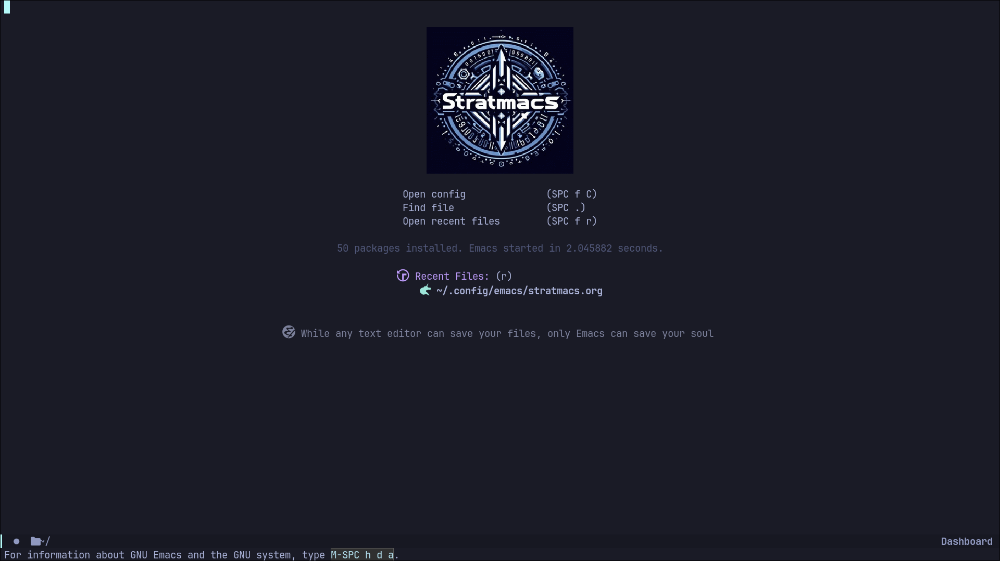

[Stratmacs](https://github.com/StratOS-linux/Stratmacs) is a bespoke Emacs [configuration](https://github.com/StratOS-Linux/Stratmacs/blob/main/stratmacs.org) created for StratOS. 
It is a general-purpose, unopinionated configuration that serves as a starter kit for Emacs. 
It includes several (minor and major) Emacs tweaks that seasoned users use in their configs.

# Usage

-   `SPC` (the _space_ key on your keyboard) is set as the
    default leader key. Press it to view a list of bindings.
-   Each character that appears on the submenu(s) is either another key
    in the key combination or the final key required to execute a
    certain Elisp function call
    -   You may view *what* a keybind does by pressing `space-h-k`
        (denoted by `SPC h k`).

## Evil mode

Stratmacs, like most Emacs \"distributions\", bundles Evil-mode - an
Emacs metapackage that brings Vim motions to the dark side.

### Basic Navigation and Editing

##### Normal Mode (default in Evil)
Similar to Vim\'s Normal mode, used for navigation and issuing commands.

- `h`, `j`, `k`, `l`: Move cursor left, down, up, and right. 

- `w`, `b`, `e`: Move by word.

- `C-a`/`0`, `C-e`/`$`: Move to the beginning and end of a line. 

- `gg`, `G`: Go to the beginning and end of the buffer. 
- `:q`, `:w`: Quit and write, just like in Vim. 

##### Insert Mode: Insert text

- `i`: Enter insert mode at the cursor position. 

- `I`: Insert at the beginning of the line. 

- `a`: Insert after the cursor.

- `A`: Insert at the end of the line. 

- `Esc`: Return to Normal mode.

##### Visual Mode: Select text for operations.

- `v`: Enter visual mode. 

- `V`: Select the entire line. 

- `Ctrl+v`: Enter visual block mode (column selection). 

##### Undo/Redo

- `u`: Undo. 
- `C-r`: Redo. 

##### Cut, Copy, Paste

- `dd`: Cut a line.

- `yy`: Copy a line. 

- `p`: Paste after the cursor. 

- `P`: Paste before the cursor.

2.  Text Objects

    Operate on text objects like words, sentences, paragraphs. ciw
    Change inside word. di\": Delete inside quotes. da(: Delete around
    parentheses. vi{: Select inside curly braces.

3.  Buffers and Windows

    :bnext or :bn: Go to the next buffer. :bprev or :bp: Go to the
    previous buffer. :bd: Close a buffer.

4.  Window Splitting

    :vsp: Vertical split. :sp: Horizontal split. Ctrl+w h/j/k/l: Move
    between windows. Ctrl+w q: Close the current window.

### Command Mode (:)

Enter command mode with : (like in Vim) to run commands such as: :w
Save the file. :q: Quit Emacs. :wq: Save and quit. :x: Save and close if
changes were made.

### Emacs-Specific Evil Extensions

Ex Commands: Use `:` commands for Emacs-specific functionality like
buffer operations or mode switching. Org-mode: Evil integrates well with
org-mode, so you can use Vim-like navigation while organizing tasks and
notes. M-x: Although Evil mimics Vim's modal behavior, you can still run
Emacs commands with M-x. For example, M-x find-file opens a file, or M-x
shell launches a shell.

### Registers and Marks

-   Registers allow you to store text or commands.

`"ay`: Yank to register a. `"ap`: Paste from register a. `:reg`: View
all registers.

-   Marks let you set and jump to positions within a buffer.

`ma`: Set mark a. `’a`: Jump to mark a.

### Searching and Replacing

1.  Search

    /pattern: Search forward. ?pattern: Search backward. n: Jump to the
    next match. N: Jump to the previous match.

2.  Search and Replace

    :%s/old/new/g: Replace old with new throughout the entire buffer.
    :s/old/new/g: Replace in the current line.

### Macros

1.  Record macros to automate repetitive tasks.

    `q <register>`: Start recording to a register.

2.  Do your commands.

    `q`: Stop recording. `@<register>`: Play the macro.

### Advanced Editing

1.  Replace Mode

    Use `R` to enter Replace mode (overwrites text instead of
    inserting).

2.  Joining Lines

    `J` to join the current line with the next one.

3.  Indenting

    `>>` to indent the current line and `<<` to dedent the current line.

### Switching Between Evil and Emacs Modes

Evil mode has several states, including Normal, Insert, Visual, Replace,
Emacs. `C-z`: Toggle between Normal mode and Emacs mode. You can use
regular Emacs keybindings (like Ctrl+x combinations) while in Emacs
state.

### Dired Mode (Directory Navigation)

Emacs has a powerful directory mode (`dired`), and you can navigate it
with Vim-like keys if Evil is enabled. dired: `SPC f d` (or `M-x dired`
to open a directory). Use `h`, `j`, `k`, `l` to navigate, `RET` to open
files/directories, `d` to delete, and `C` to copy.
