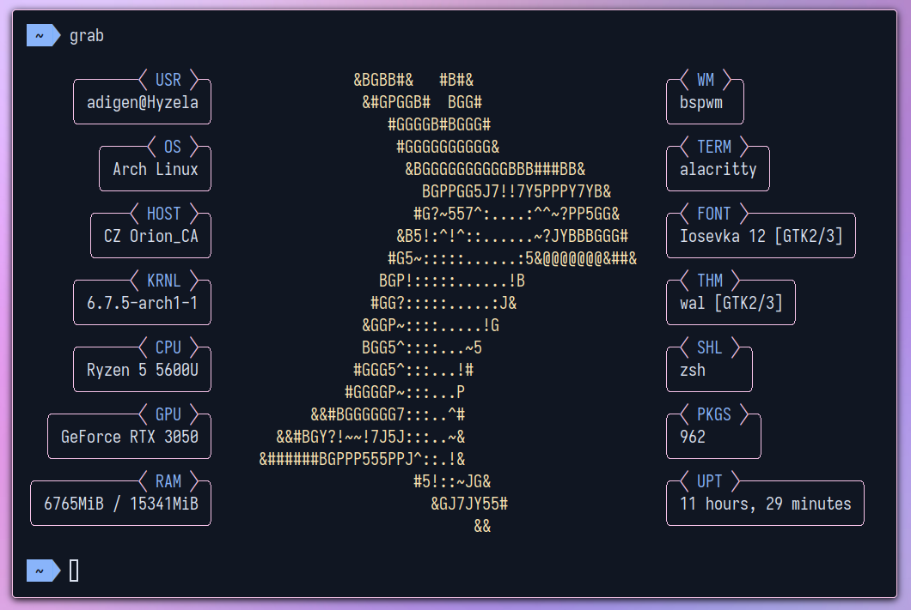

# Introduction

Grab is a custom fetch script made for StratOS.

# What is it made using ?

Grab is made using POSIX `sh` and `C++`.

# What does it do ?

Grab is a custom fetch script made for our operating system. Upon running the command, it shows an overview of the specifications ofthe host system just like [neofetch](https://github.com/dylanaraps/neofetch)

# How does it work

Grab uses shell commands inside C++. The C++ part of the code handles all the layout calculations and printing. The shell script (under the shell\_script variable) fetches the info.

The reason for using shell scripts is that they are easier to expand upon than C++ code. However, due to the fact that printing in shell is very slow for a cosmetic interface like a fetch script, C++ has been used alongside shell scripts.
