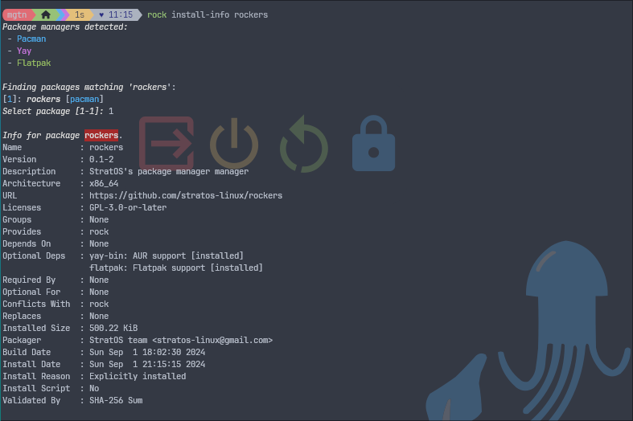
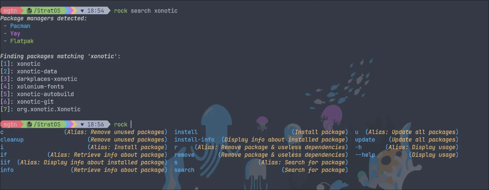

# Introduction

[Rockers](https://github.com/stratos-linux/rockers) is a **meta-package manager** for managing packages across the various strata offered in [StratOS](https://stratos-linux.github.io). Rockers is a Rust rewrite of the [Rock](https://github.com/stratos-linux/rock) meta-package manager. 

# Salient features:
- **Intuitive** to use
- **Beginner-friendly** subcommands
- Visually appealing **coloured** output for distinguishing package managers
- **Numbered** output for easy selection
- Shell (currently only Fish) **autocompletion** for subcommands
- **Trivial** to add new package managers

# Roadmap:
- Autocompletion for package names
> Difficult to implement since not all repositories can be queried (or respond quickly).
- Ability to select multiple entries at once from the package listing

# Gallery:

